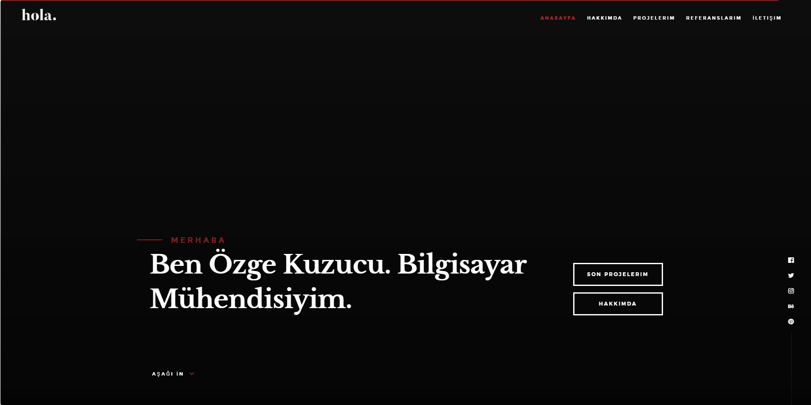
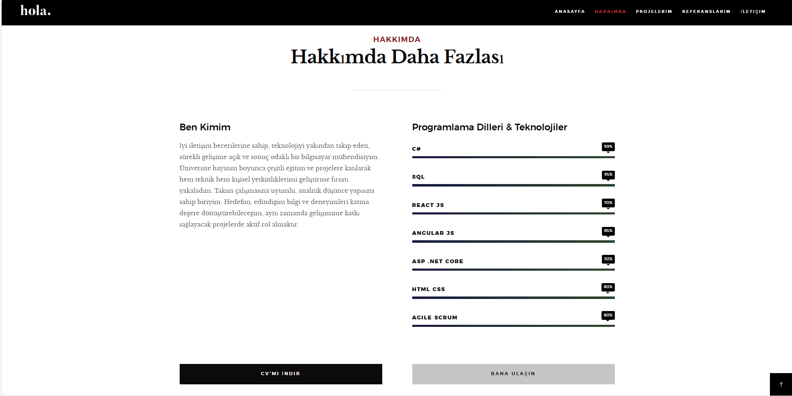
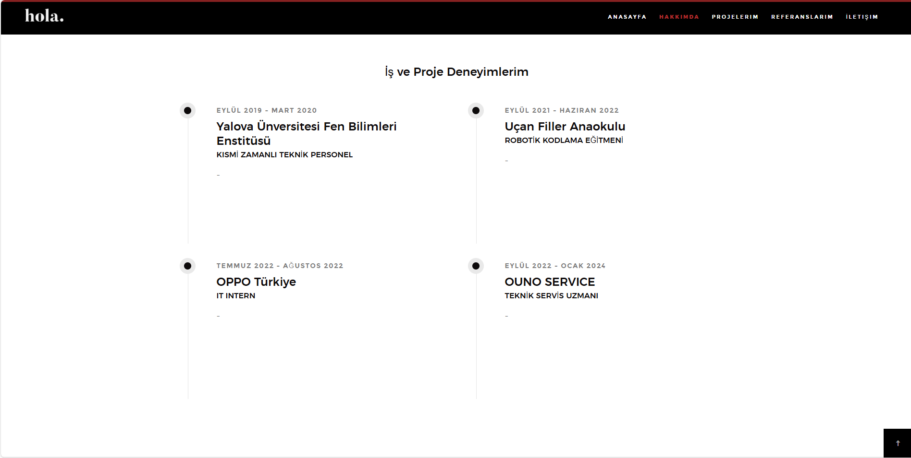
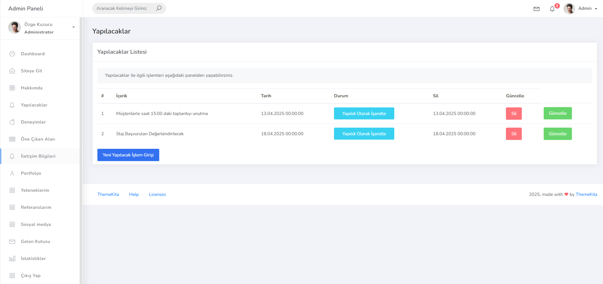
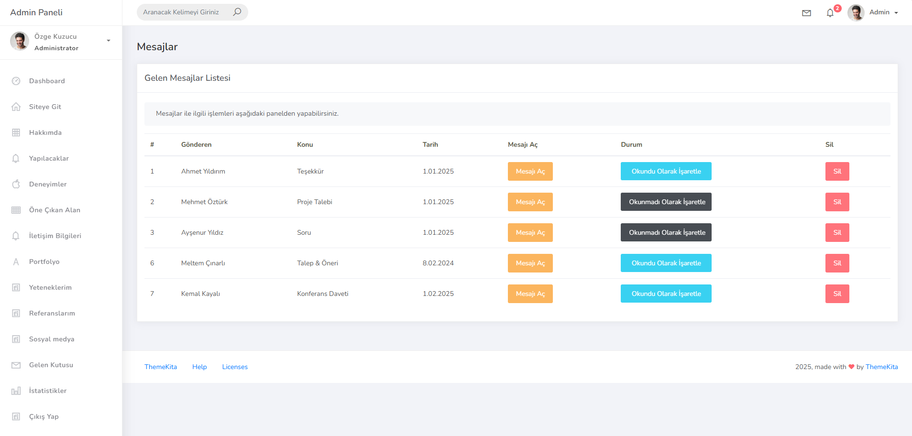
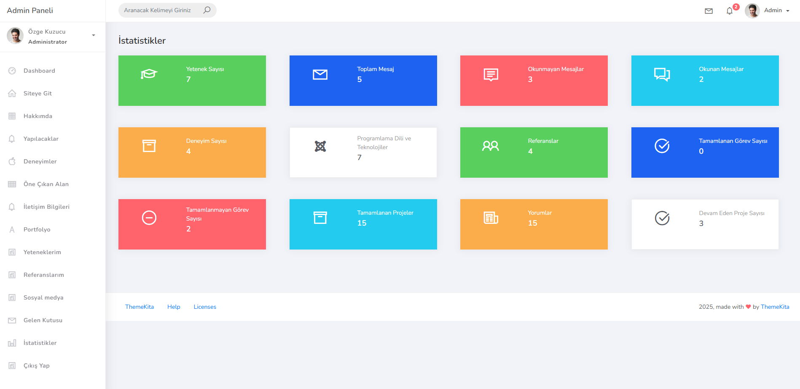

# 🚀 Kişisel Portföy Sayfası

Bu proje, **Udemy** platformunda **Murat Yücedağ** tarafından verilen 🎓 _"Asp.Net Core ile Portfolyo Uygulamanızı Geliştirin - Part 1 & Part 2"_ eğitimi kapsamında geliştirilmiştir.

Bu portföy sitesi ile hem **kişisel bilgilerinizi ve projelerinizi sergileyebilir**, hem de içerikleri dinamik olarak yönetebilirsiniz.

---

## 📌 Projeye Genel Bakış

### 🖱️ Admin Paneli
- Kişisel bilgiler, projeler, referanslar ve sosyal medya hesaplarının CRUD işlemleri
- İçeriklerin kolayca eklenip düzenlenebileceği kullanıcı dostu bir arayüz

### 👤 Kullanıcı Arayüzü
- Modern, şık ve mobil uyumlu tasarım
- CV’nizi ve projelerinizi etkileyici şekilde sunma imkânı

---

## 🛠️ Kullanılan Teknolojiler

### Backend
- ✅ ASP.NET Core 6.0
- ✅ Entity Framework Core (EF Core) – Code First Yaklaşımı
- ✅ Microsoft SQL Server
- ✅ LINQ

### Frontend
- ✅ HTML5
- ✅ CSS3
- ✅ Bootstrap 5
- ✅ JavaScript

---

## 🧱 Proje Mimarisi

- **Entity Layer**: Code-First ile veritabanı tabloları
- **Data Access Layer (DAL)**: EF Core ile veri işlemleri
- **Presentation Layer**: Razor View Engine ile hazırlanmış kullanıcı arayüzü

---

## 📷 Proje Görselleri

